# User manual

This manual describes how to use the Bowtie++ application.

- [User manual](#user-manual)
  - [Create diagrams](#create-diagrams)
  - [Authentication](#authentication)
    - [Create an account](#create-an-account)
    - [Manage your account](#manage-your-account)
    - [Enable two-factor authentication](#enable-two-factor-authentication)
  - [Accessing the statistics](#accessing-the-statistics)
  - [Save diagrams](#save-diagrams)
    - [Save locally](#save-locally)
    - [Save online (in database)](#save-online-in-database)
  - [Open diagrams](#open-diagrams)
    - [Open local diagrams](#open-local-diagrams)
    - [Open online diagrams](#open-online-diagrams)
  - [Share diagrams](#share-diagrams)
    - [Access diagrams people shared with you](#access-diagrams-people-shared-with-you)
    - [Managing users whom you shared the diagram with](#managing-users-whom-you-shared-the-diagram-with)
  - [Versioning](#versioning)
  - [Risk Computation](#risk-computation)
  - [Helper to fill-in likelihood and impact matrices](#helper-to-fill-in-likelihood-and-impact-matrices)
  - [Comments on the diagram's components](#comments-on-the-diagrams-components)
  - [User Tutorial](#user-tutorial)

## Create diagrams
The Bowtie++ application starting page looks like this: 

- The **blue** 🔵 area contains the elements you can add to your Bowtie diagram.
- The **red** 🔴 area is where you can edit the elements of your Bowtie diagram.
- The **green** 🟢 area allows you to edit the font and text style of a selected element in the diagram. To select an element, click on it. If nothing is selected, you can edit the display settings of the diagram (Grid, Page views, etc.) by checking the corresponding box. It also contains a tutorial which guides you throughout the whole creation of your diagram. 
- The **yellow** 🟡 bar allows you to:
  - Change the zoom. 
  - Undo or redo actions. 
  - Delete a selected element.
  - Move the selected element to foreground or background. 
  - Edit the style of the links of a selected element.
   

To add an element to your Bowtie diagram, you can either click on the element in the **blue** 🔵 area or drag and drop the element from the **blue** 🔵 area to the diagram in the **red** 🔴 area.

To link elements on the diagram, left-click on the border of the first element and **hold** down the mouse button to the border of the second element: 

## Authentication

Bowtie++ offers an authentication service so you can save your work and share it with other users. 

### Create an account

**First**, take notice of the **User account management and requirements** section in the `wiki.md` file.

To create your account, use the "Sign in" button at the top right of the home page, and then use the "sign up" link to access the registration page. You'll be asked to enter a username, an email and a password. Username and password follow the policy:
- **Username** : can only be composed of letters, digits, underscores, dashes and space. It can not begin by a white space.
- **Password** : at least 9 characters and a mix of letters (uppercase AND lowercase), digits and special characters (must contain at least one character of each type mentioned previously).

The email you give must be an existing email since it will be used by several key functionnalities in Bowtie++. After clicking on the "sign up" button, an email will be sent to you and you must use the link to confirm that it's one of yours. If the confirmation is successful, you'll see a message like the following one after clicking the link:

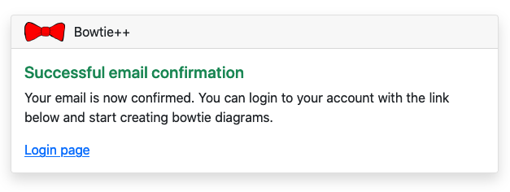

When your account has been successfully created, go back to the login page and enter your credentials. Once your logged in, you should see that the navigation bar has changed and looks like this:

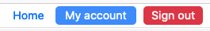

### Manage your account

To access your account settings, click on "My account". This page is composed of three menus:
- Your profile information.
- The "Security" menu where you can change your password and enable the two-factor authentication.
- The "Danger zone" menu where you can delete your account. This deletion is definitive -- all data is erased from the database.

### Enable two-factor authentication

On the account settings page, go to the "Security" tab and click on "Enable 2FA".

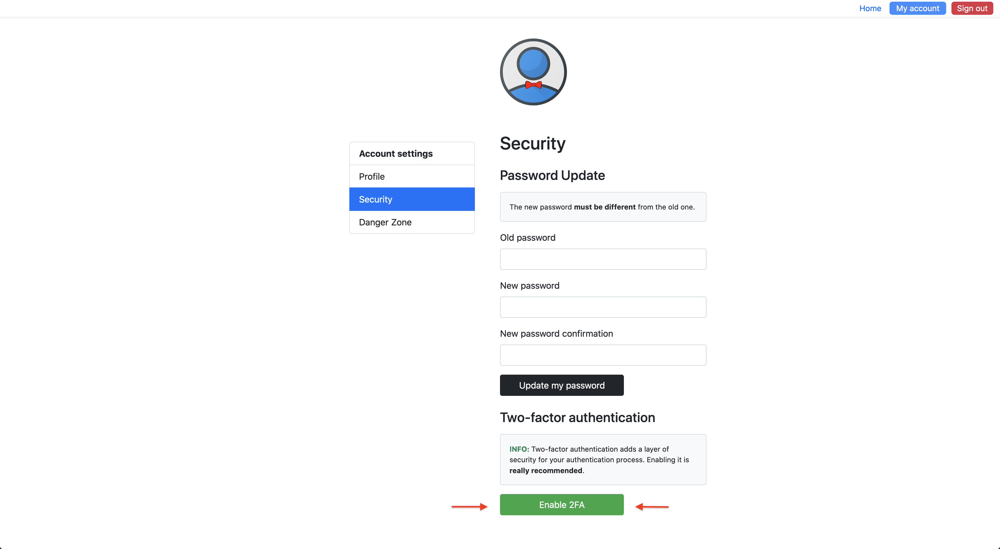

A QR that you need to scan with the appropriate application (Google Authenticator or FreeOTP form Redhat, for example) will appear, like showed on the following picture.

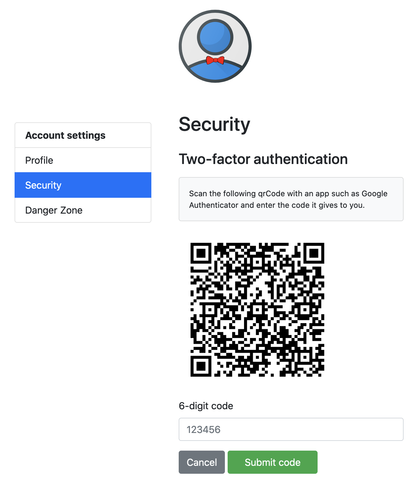

Type the code the authentication app gives to you and submit it in the corresponding field below the QR code. Two-factor authentication is now enabled. Every time you'll try to sign in to Bowtie++, you will be asked to provide a 6-digits code. This code is the one given by the authentication app. You can disable two-factor authentication at any time.

**WARNING**: if you lose or delete the token stored in the 2FA application (for instance in Google Authenticator), you will **NOT** be able to log in Bowtie++ unless you ask an administrator to disable the two-factor authentication on your account. Be careful!

## Accessing the statistics
Statistics are provided to users who have the **Researcher** status. This status can only be given by an administrator. If you have a researcher status, a link to the statistics page will be added to your navigation bar. When you click on this link, the following page will be open:

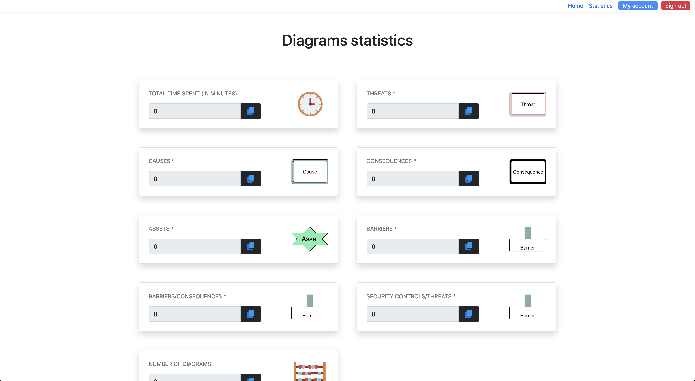

You can download the data in a csv file at the bottom of the page:

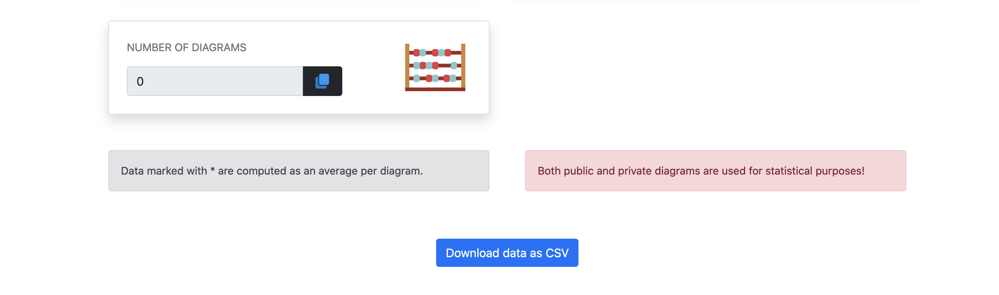

## Save diagrams
After modifying a diagram you might want to save it. 
### Save locally
To save a diagram locally, use the 'Export' button and choose one of the following formats : XML, PNG, SVG or JPEG.
You can also generate a scientific report (in PDF format) that summarizes the case study by clicking on the 'Generate report' button. You can find an example of such a report in the image below :

### Save online (in database)

Instead of having to store the diagram on your computer you may want to save it in the database. To do so, click on 'Save' button, as shown bellow:

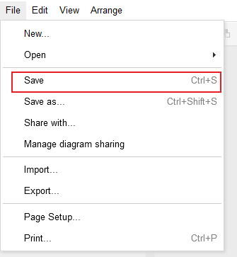

The saving interface will then open: 

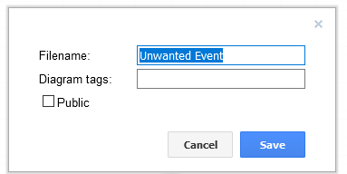 

There, you can input the following parameters:
- The name of the diagram (by default it's the name of the unwanted event).
- The tags you want your diagram to be referenced by, tags are like keywords that are separated by a ",".
- If the diagram is meant to be public (i.e any user can see it and copy it). 

Once the diagram has been saved once, you can modify it and save it again without having to input all those parameters by pressing the 'Save' button again.

If you want to input existing parameters again (for instance, choose a new name for the diagram) you can do so by pressing the 'Save as...' button, like bellow:

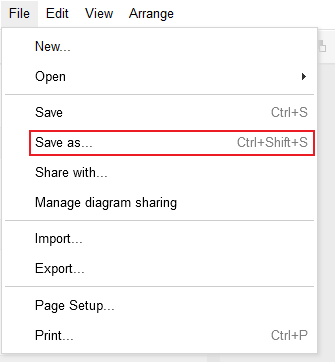

## Open diagrams
Once a diagram is saved on your computer or in the database you can open it again.
### Open local diagrams
You can open a diagram stored on your computer in two ways.

Firstly, you can click on the 'Import' button like shown bellow:

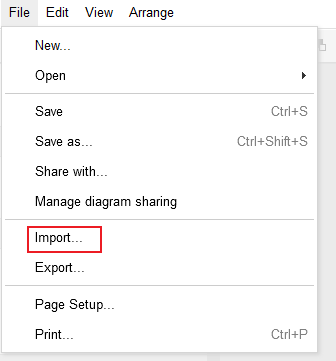

Then choose the file containing your diagram.

Secondly, you can use the 'Open' menu (shown bellow) then choose 'Open local file...' and choose the file containing your diagram.

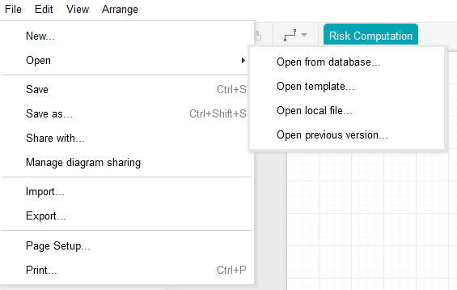

### Open online diagrams
To open the diagram from the database, you can click on the 'Open' button, then choose 'Open from database...' or 'Open template...' (like shown bellow) :

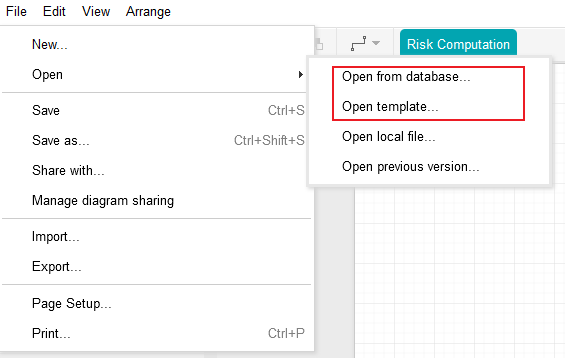

When clicked, it will load a new interface where you'll be able to see all the diagrams stored in the database that you have access to (either they are yours, or public, or someone shared them with you).

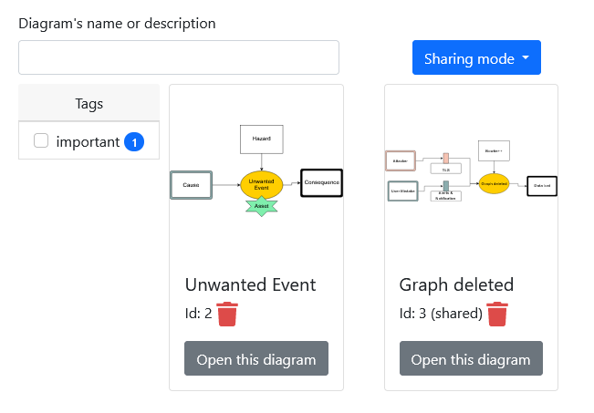

By default, this interface will show you all the diagrams that you own (private diagrams), or that someone shared with you (shared). But you can also select all the public diagrams by selecting 'Public' in the 'Sharing mode' bellow:

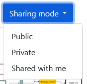

You can select which diagram you want to be displayed by typing its name or its description (node values, like 'Unwanted Event' or 'Hazard' for the diagram with id:2). You can also use tags to select which group of diagrams you want to display.

By pressing the red bin graphic can you can delete a diagram from the database, you can do so only if you are the owner, or if it was shared with you (in that case you will only delete your link to the diagram since you're not the diagram's owner).

[TEMPLATE DESCRIPTION]
If you click the 'Open template...' button, a new interface containing all the available templates will be loaded. The templates aim to help users create diagrams as they won't start "from scratch" but based on existing information about certain topics.
[ADD TEMPLATE IMAGE]

## Share diagrams

To share a diagram, you must first save it in the database, then just click on the 'Share with' button shown bellow:

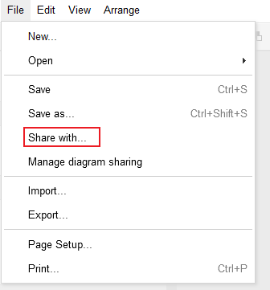

It will prompt you to enter the email of the user you wish to share the diagram with, and to choose its role, the following are available:
- **reader**, meaning the user will only be able to see the diagram.
- **writer**, the user will be able to modify the diagram.

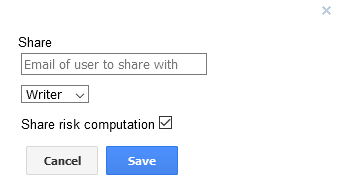

Moreover, there is a checkbox allowing to share the risk computation. This box is checked by default. More details about the risk computation [here](#-Risk-Computation).

### Access diagrams people shared with you

Once someone shared a diagram with you, you can find it by clicking on the 'File'>'Open'>'Open from database' button. Then, select the 'Sharing mode' : 'Shared with me'. There, you can easily access diagrams that people shared with you.

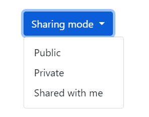

### Managing users whom you shared the diagram with

Once you shared a diagram with other users, you might want to manage the roles and maybe remove access to the diagram from a certain user. 
Bowtie++ offers this functionnality through the 'Manage diagram sharing' button shown bellow:

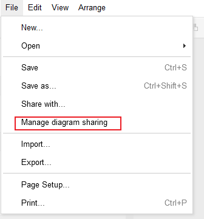

It will then open the management interface shown bellow:

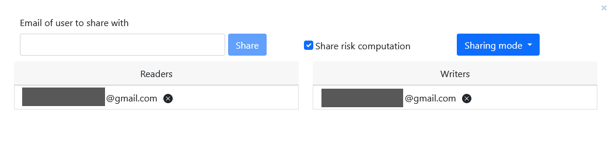

Through this management interface, you can:
- **Share with a new user**, by typing their email, choosing their role and selecting whether you share the risk computation or not. 
- **Remove user access**, by clicking the black cross next to a user email.
- **Modify the user's role**, by dragging and dropping their email in the relevant column.

## Versioning

🔴 WARNING: Currently this feature is occasionning a nasty bug with VueJS that may result in you browser crashing (because of an infinite recursion in the reactive declaration of a new Object through VueJS). Hence, it is strongly recommanded to avoid using Versioning.

You may want to go back to a previous version of the diagram you're working on (created each time you save it). To do so, in the same way as for online diagrams, use the 'Open' menu and choose 'Open previous version...', as shown bellow:

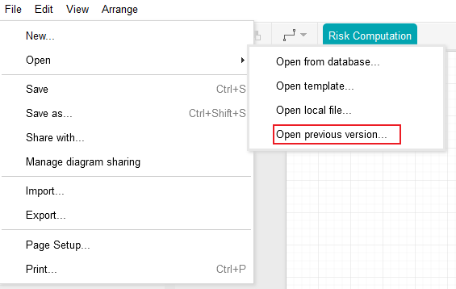

You will have access to a new interface with all the existing versions of your diagram, with the number corresponding to the version and its date of creation. Select the one you want by pressing the 'Revert to this diagram' button. The version you were working on so far will remain in the list of versions but all the modifications made to the diagram which were not saved will disapear.

## Risk Computation

If you want to quickly edit a threat's parameters, you can directly click on the likelihood matrix linked to the threat.

To open the risk computation window and check or edit threats', consequences' and barriers' parameters, click on the "Risk computation" button: 

The following window will show up: 

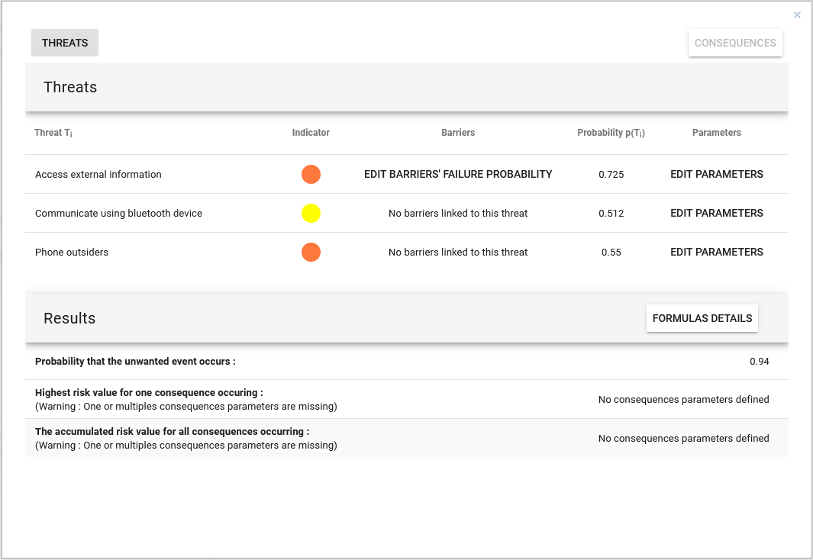

The first table allows you to see and edit the threats' and consequences' parameters. To switch between threats or consequences, click on the corresponding button in the top-left or top-right corner.

**Threats table**

Threat's parameters can be edited by clicking on the "Edit parameters" Button, which will display the following line: 

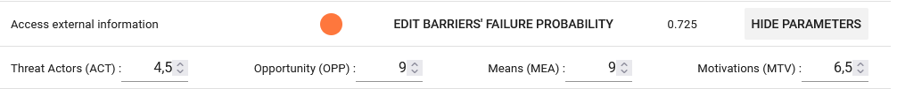

You can edit barriers' failure probability by clicking on the "Edit Barriers' failure probability" button, which will display a small menu showing barriers linked to the threat and their failure probability.

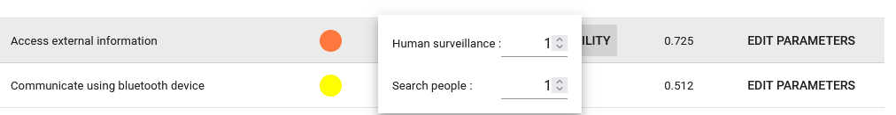

**Consequences table**

Clicking on the "Consequences" button in the top-right corner will display the consequences parameters in the first table.

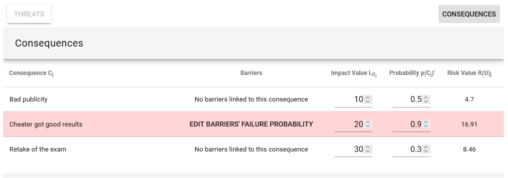

Consequences' parameters can be directly edited. The barriers' failure probability can be edited just like the threats' one, by clicking on the "Edit barriers' failure probability" button.
The consequence's line with the highest risk value is highlighted in red.

**Results table**

This table allows to see different results. To check which formulas are used to compute these results, click on the "Formulas Details" button: 

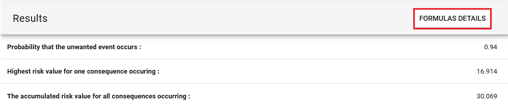

This window will show up: 

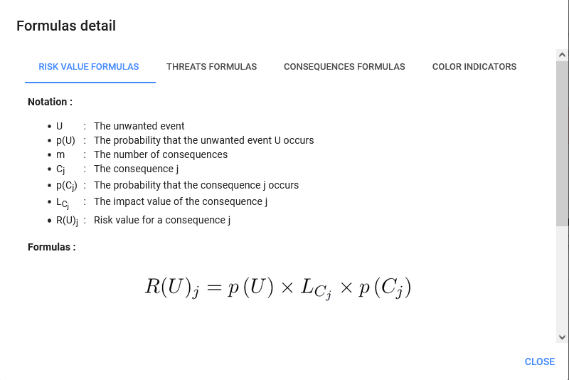

You can navigate through formulas by clicking on the different tabs. The last tab "Color indicators" shows the table used to convert values to colors and vice versa.

## Helper to fill-in likelihood and impact matrices 

Filling-in likelihood and impact matrices can be challenging without proper support. So to properly fill-in these matrices, it is strongly recommended to check our helper box. As it is possible to see in the following image, after selecting the 'help' button, a new interface will be loaded for the matrix chosen. The helper contains definitions for each parameter of the matrix and an area where you can enter the scale related to your matrix. This will allow any user to understand the level of danger related to each parameter of your likelihood or impact matrices.

## Comments on the diagram's components 

It is now possible to add comments on every single element of your diagram. This feature is particularly useful if you want to add more information (a description, a URL link or else ) to your diagram. A little circle will then appear on the top of the element (on which you added your comment) to visually signal the presence of your comment. In the image below, the circle appears inside the yellow circle and the comment associated is inside the red rectangle on the right.

## User Tutorial 
This feature guides you throughout the whole creation of your diagram. All you have to do is follow the steps as depicted in the image below. After the completion of the current step, the tutorial updates itself to show you the following step. This is particularly helpful if it's your first time using the BowTie++ software.
These are the steps you can follow to create your diagram according to the top-down approach :

  - Step 1 : Choose the unwanted situation you want to analyse. Only one is allowed.
  - Step 2 : Choose the main hazard related to the studied unwanted event. Only one is allowed.
  - Step 3 : Choose the assets of your diagram, ie. the resources you want to protect. It is usual to have several assets, think about what is valuable !
  - Step 4 : Fill the left side of the diagram with all the events that can lead to the unwanted situation. Usually, a complete diagram should have on average 8 threats and/or causes. Be exhaustive and keep the most important elements.
  - Step 5 : Add barriers to increase the left filling rate and improve the diagram's quality.
  - Step 6 : The effectiveness of a barrier can be diminished by the occurence of other events. Add escalation factors to model precisely a barrier and its failure probability.
  - Step 7 : Fill the right side of the diagram with all the consequences resulting by the unwanted event. Usually, a complete diagram should have 4 consequences at least. Be exhaustive and keep the most important ones !
  - Step 8 : Add barriers to increase the right filling rate and improve the diagram's quality.
  - Step 9 : The effectiveness of a barrier can be diminished by other events. Add escalation factors to model precisely a barrier and its failure probability.

  , 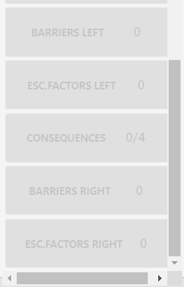

